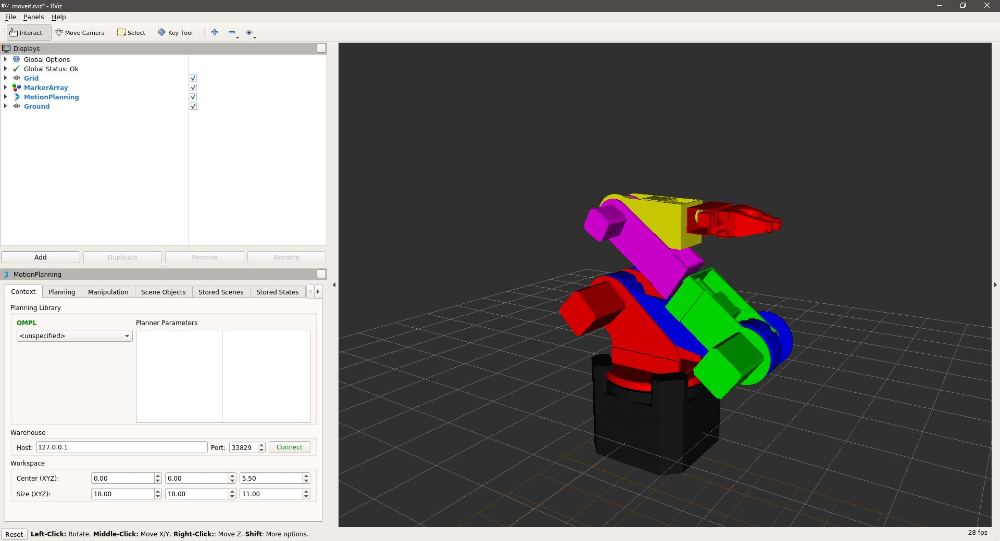

# Brazo_MoveIt
Este repositorio contiene los archivos de MoveIt del brazo de 6 grados de libertad Robocol.

## Paquetes requeridos
Para usar este paquete se requiere tener instalado:
- Ubuntu 18.04:
La instalación de Ubuntu 18.04 se encuentra en el siguiente link:
https://ubuntu.com/download/desktop
- ROS Melodic.  
La instalación de ROS Melodic para Ubuntu 18.04 se encuentra en el siguiente link:  
http://wiki.ros.org/melodic/Installation/Ubuntu
- Moveit.  
La instalación de Moveit se encuentra en el siguiente link: (Se requiere tener ROS para instalar MoveIt)  
http://docs.ros.org/melodic/api/moveit_tutorials/html/doc/getting_started/getting_started.html

## Ejecutar el brazo

Este repositorio es un paquete de ROS, no un Workspace, por lo que se debe realizar el respectivo git clone en la carpeta robocol_new_arm/src (Ambas vacías). 

- En caso de no tener configurado el ambiente de ROS:
```console
source /opt/ros/melodic/setup.bash
```

- Crear un worskpace (si no tiene uno ya):
```console
mkdir -p ~/arm_ws/src
```

- Ir a la raíz del workspace:
```console
cd ~/arm_ws/
```

- Construir un catkin workspace (con _catkin\_make_ o con _catkin build_):
```console
catkin_make
```

El comando anterior crea los directorios de _build_ y _devel_ en la raiz del workspace (junto a la carpeta de _src_).

- Dirigirse a la carpeta raíz de los paquetes (la carpeta src que debe de estar vacía):
```console
cd ~/arm_ws/src/
```

- Clonar el paquete de brazo en _arm\_ws/src_:
```console
git clone https://github.com/jcgutierrezg/ARM-MoveIt
```

- Volver a la raíz del workspace:
```console
cd ~/arm_ws/
```

- Actualizar (o construir, si no se ha hecho antes) el catkin workspace (debe usar el mismo que usó antes _catkin\_make_ o con _catkin build_):
```console
catkin_make
```

- Configurar el entorno del nuevo workspace con el nuevo archivo _setup_ generado, recordar que _source_ y _._ son el mismo comando:
```console
source devel/setup.bash
```

- Correr el archivo launch principal del brazo (no se requiere tener un roscore activo debido a que es un roslaunch y no un rosrun):
```console
roslaunch robocol_new_arm display.launch
```



- Si ya eres pro y necesitas ahorrarte la fatiga de copiar todos los comandos uno a la vez, de nada:

Para instalar:
```console
source /opt/ros/melodic/setup.bash
mkdir -p ~/arm_ws/src
cd ~/arm_ws/
catkin_make
cd ~/arm_ws/src/
git clone https://github.com/robocol-rem-u/robocol_new_arm.git
cd ~/arm_ws/
catkin_make
source devel/setup.bash
roslaunch robocol_new_arm display.launch
```
Para correr:
```console
source /opt/ros/melodic/setup.bash
cd ~/arm_ws/
source devel/setup.bash
roslaunch robocol_new_arm display.launch
```
